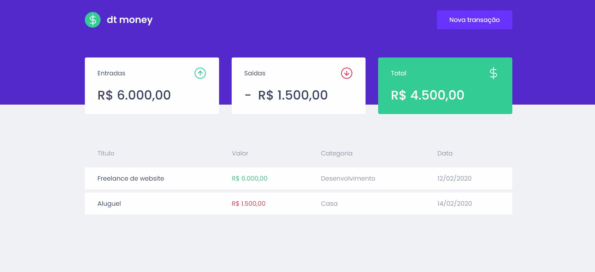

# dt money

Este projeto se trata de uma simples aplicação web para gerenciar o fluxo de caixa pessoal.
Foi desenvolvido ao longo do segundo capítulo da trilha de ReactJS do Ignite, bootcamp oferecido pela [Rocketseat](https://www.rocketseat.com.br/). 

Os principais tópicos explorados neste projeto incluem:
- Utilização do [Create React App](https://create-react-app.dev/) para gerar um *boilerplate* consistente de um projeto React
- Estilização CSS-in-JS através do [Styled Components](https://www.styled-components.com/)
- Criação de uma API (backend) fake com [Mirage.js](https://miragejs.org/) com o propósito de "mockar" (simular) a integração entre o frontend e o backend.
- Uso da [Context API](https://pt-br.reactjs.org/docs/context.html) do React como forma de compartilhar dados entre componentes
- Criação de [*hooks* customizados](https://pt-br.reactjs.org/docs/hooks-custom.html) para reaproveitamento de código em múltiplos componentes
